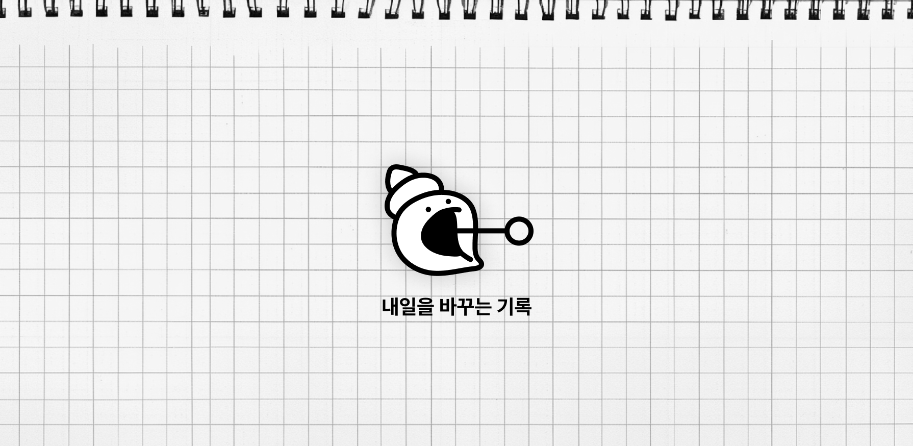
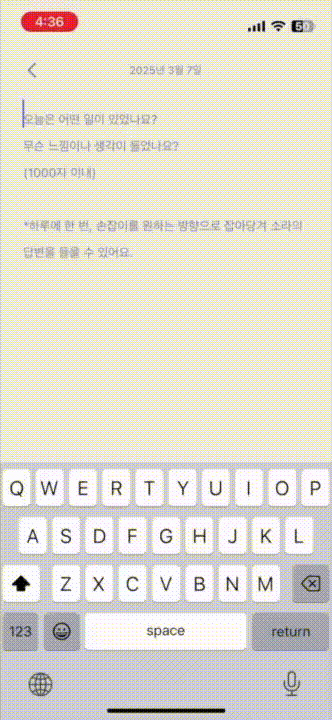

<table align="center">
  <tr>
    <td>  </td>
    <td> <h1>COMAtching</h1> </td>
    <td>  </td>
  </tr>
</table>

  AI 회고 습관 형성 서비스

   

# 🎈 프로젝트 소개

# 자주 하고픈 회고, 띄엄띄엄 쓰고 계신가요?

아니면 그냥 흘러가는대로 살고 계신가요?

✍️ 빠르게 움직이고 변화하는 삶 속에서 성장하기 위한 방법은 바로 **회고**입니다. 그러나 기존의 회고는 **공허한 외침**이라, 주기적으로 작성하자는 나와의 약속을 지키기란 참으로 어렵습니다.

🐚 소라의 마법에서는 사용자가 작성한 회고 내용에 대해 **AI Agent**인 소라가 응답을 제공합니다. 내가 원하는 **성격**의 소라와 이야기를 하다 보면, 마법처럼 **회고 습관을 쉽고 재미있게** 그리고 확실하게 만들 수 있을 거예요!

# 🎈 주요 기능

## 회고 작성 및 AI 리뷰 

<table>
  <tr>
    <td>
      
    </td>
    <td>
      회고를 작성 후 sora에게 리뷰를 받을 수 있습니다.  
      사용자의 기호에 따라서 MBTI 성향 F/T 중 1개를 선택하여 리뷰의 타입을 지정할 수 있습니다.  
      리뷰는 LLM을 통해서 스트리밍 됩니다.  
    </td>
  </tr>
</table>

## 기술 스택 & 아키텍처

## ERD 설계

